# greenwood-library-website

# Repository URL - https://github.com/Agbedeyisegun/greenwood-library-website

- Step 1 

Creation of Directory of the Project - ai startup Company website directory with README file Screenshot below:

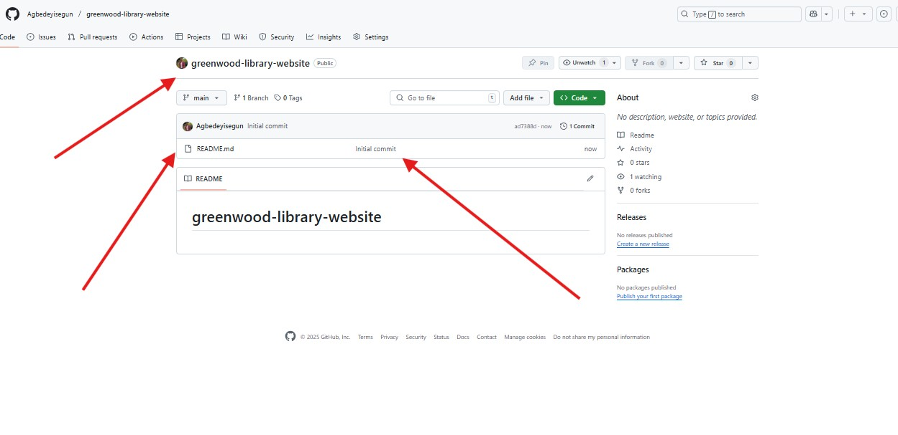

- Step 2 

Clone of the directory with README file on the local repo with git_bash editor using the cmd `git clone https://github.com/Agbedeyisegun/greenwood-library-website.git`, and `cd greenwood-library-website` to move to the directory. Screenshot below:

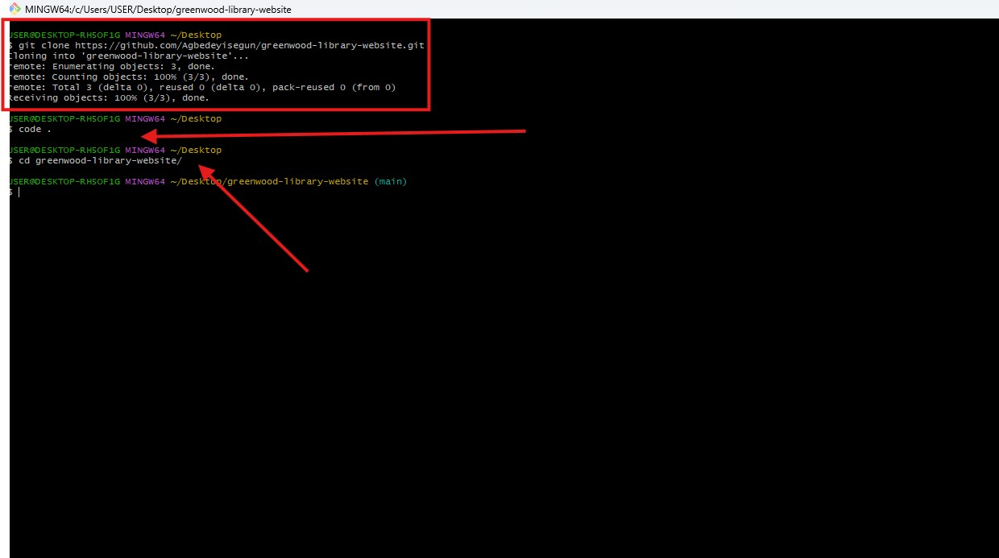

- Step 3 

Add home, contact_us, events and about_us html file with git_bash editor "main" branch for the other branch to pull and work with it using cmd `git add`, `git commit` and `push origin main`. Screenshot below:

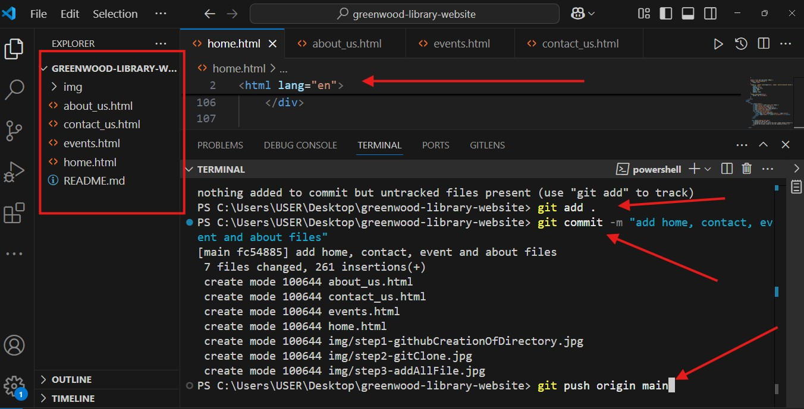

- Step 4 

Morgan create his branch and check the directory he is with these cmd `git checkout -b add-book-reviews` and `git branch` respectively. Screenshot below:

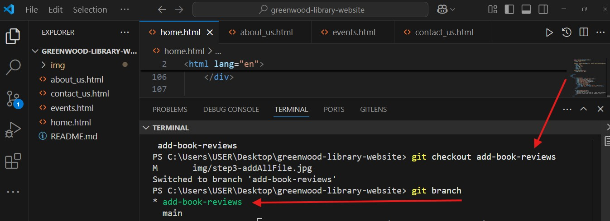

- Step 5a

Morgan add book review file with these cmd  `git push origin add-book-reviews`. Screenshot below:

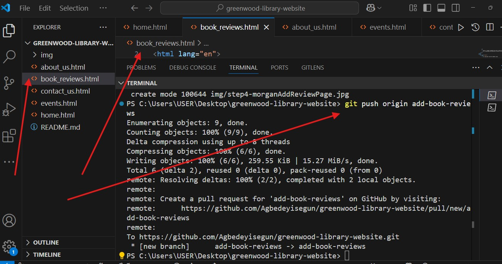

- Step 5b

Morgan Open a pull request. Screenshot below:

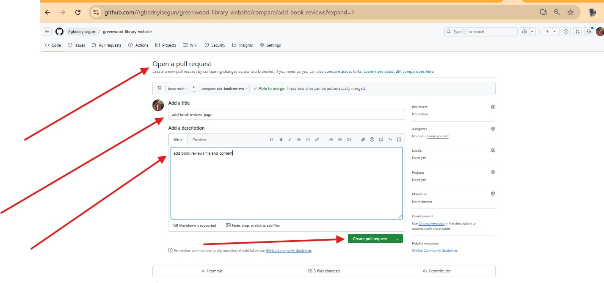

- Step 6

Morgan creating pull request. Screenshot below:

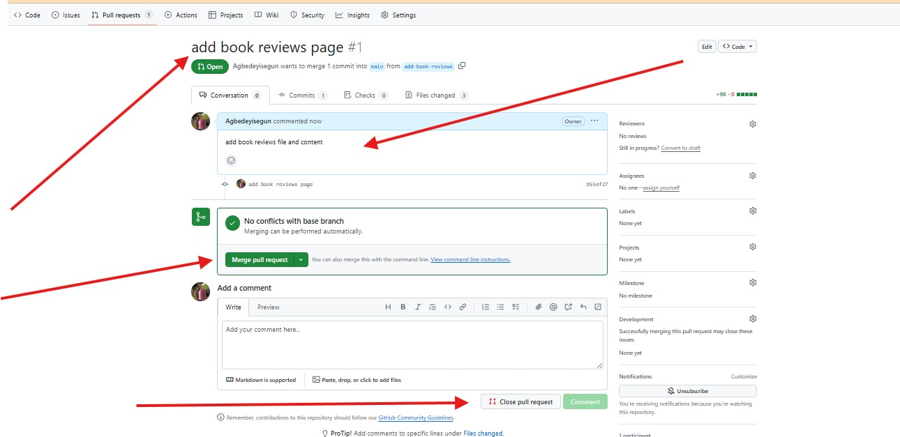

- Step 7

Overview of Morgan pull request. Screenshot below:

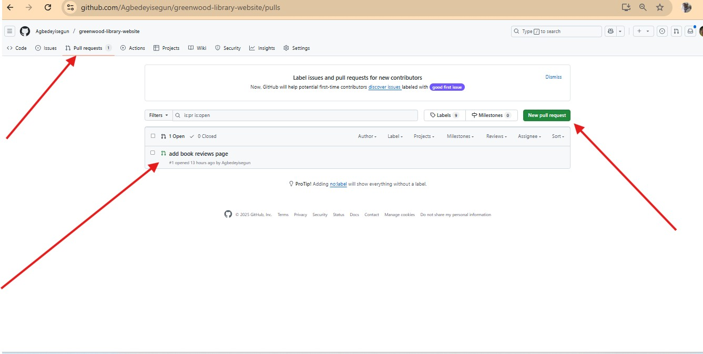

- Step 8

Checking of Morgan pull request before merge with main. Screenshot below:

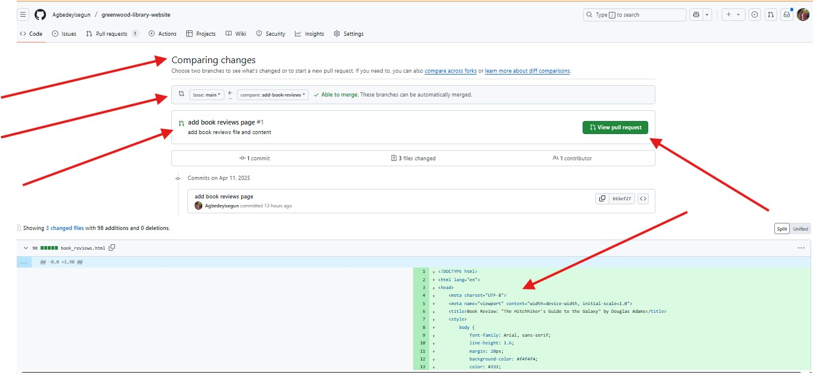

- Step 9

Merged Morgan pull request with the main branch. Screenshot below:

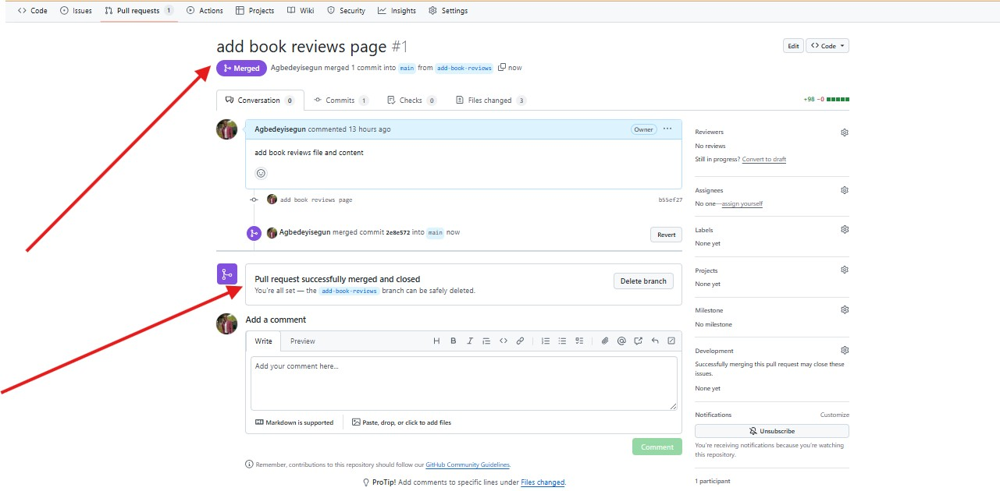

- Step 10

Jamie create and move into his branch "update-events", checked the branch and pull the changes from main branch to make sure he is working with the latest changes in the project with these cmd `git checkout -b update-events`, `git branch` and `git push origin main` respectively. Screenshot below:

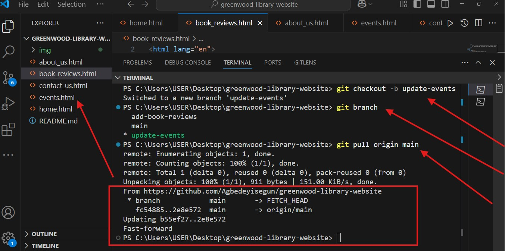

- Step 11

Jamie updated the "update-events" file, add it to the staging area, commit it to the local repo then pushed to the remote repo of the project with these cmd `git add .`, `git commit -m` and `git push origin update-events` respectively. Screenshot below:

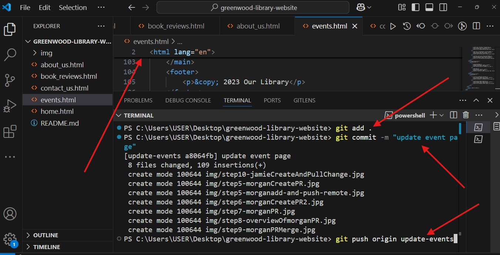

- Step 12

Jamie overview of output of the push to remote repo. Screenshot below:

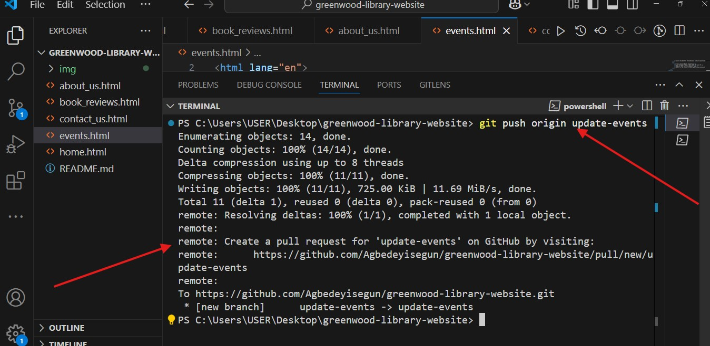

- Step 13

Jamie output of the open pull request on the Github repo. Screenshot below:

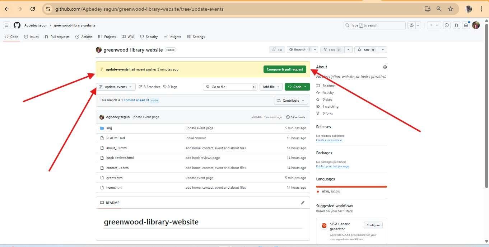

- Step 14

Jamie creation of pull request on the Github repo. Screenshot below:

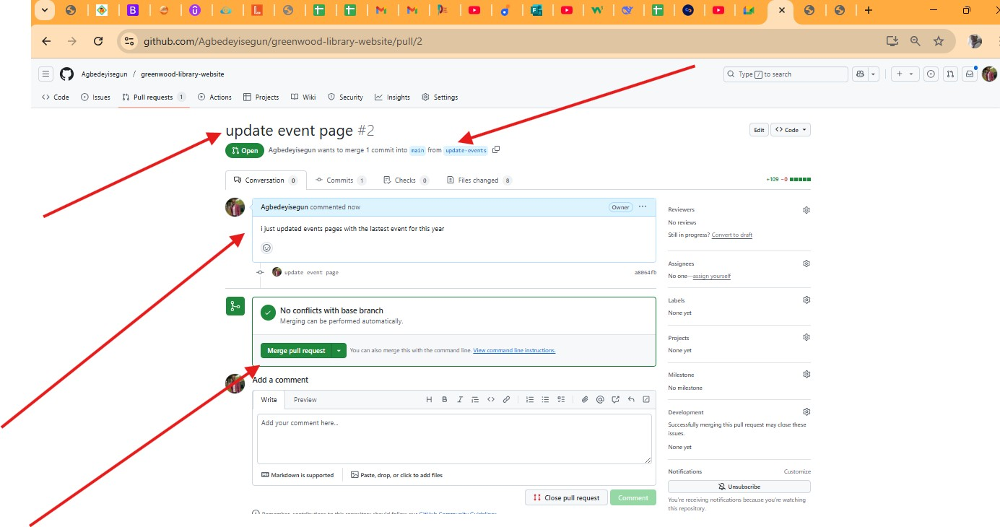

- Step 15

Comparing Jamie pull request on the Github repo. Screenshot below:

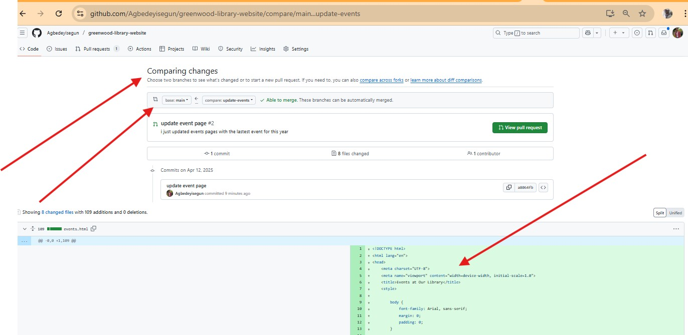

- Step 16

Merged Jamie pull request on the main branch in Github repo. Screenshot below:

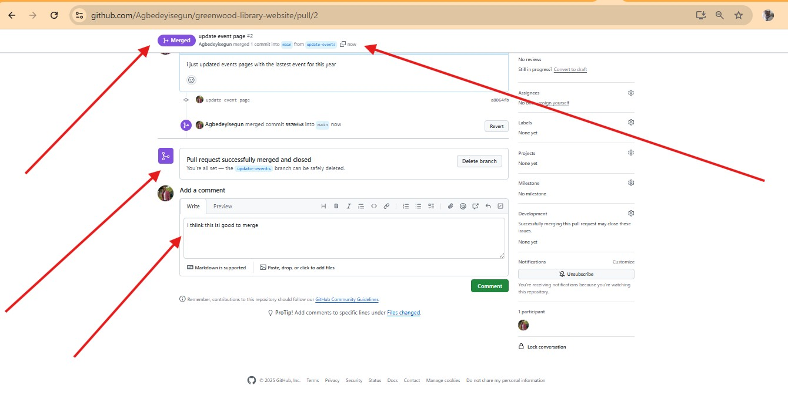

- Step 17

Evidence of No other pending pull request on the main branch in Github repo. Screenshot below:

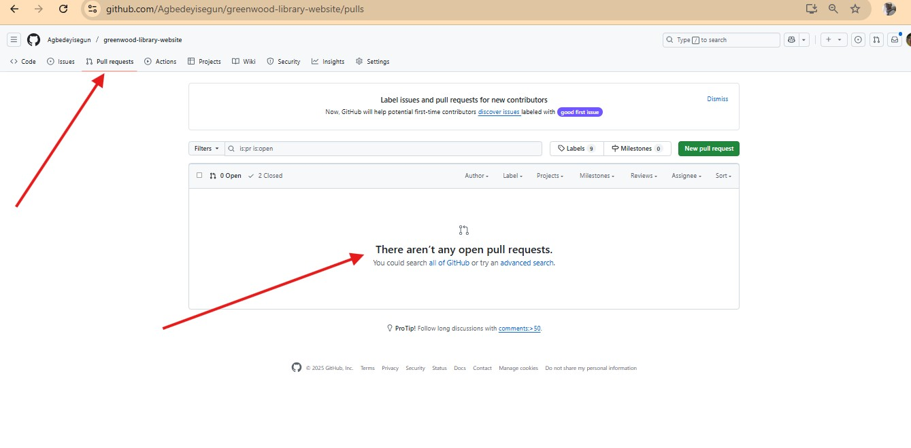